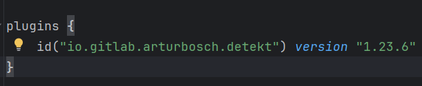
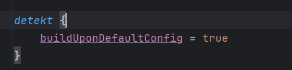
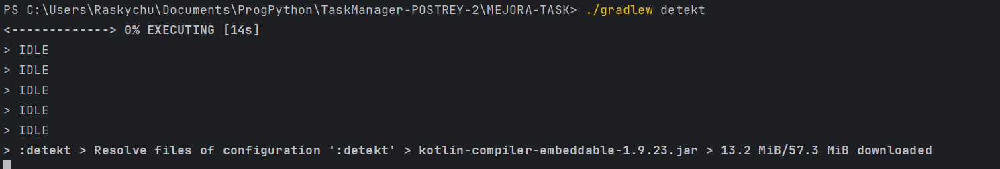
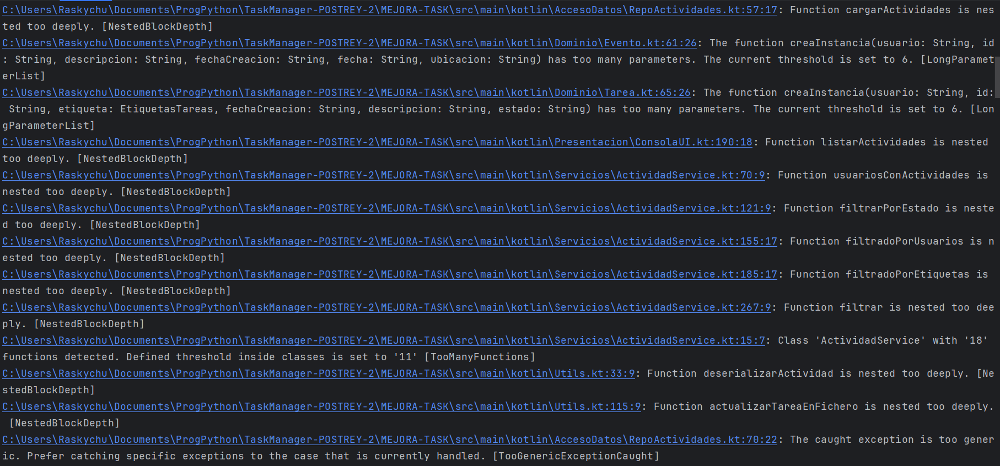
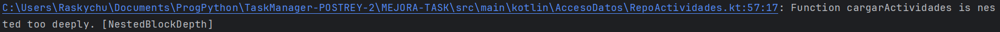
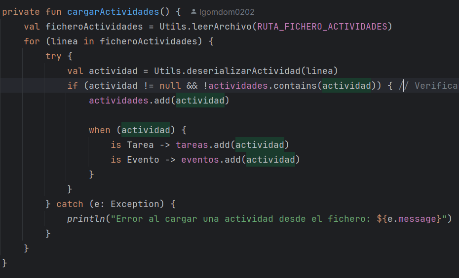
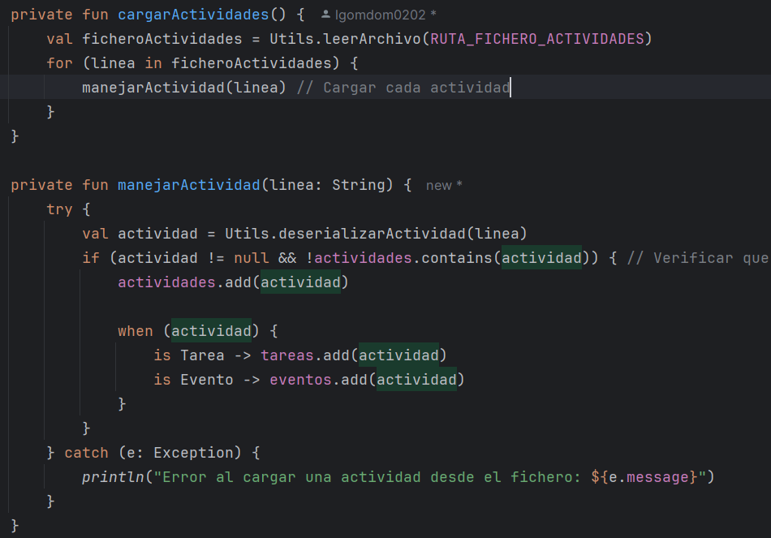

# Listing

En esta actividad vamos a instalar y utilizar Detekt, una herramienta de análisis estático para Kotlin.
Voy a hacer una guía de como instalarlo y vamos a utilizarlo para encontrar errores en el código del Task Manager.

1. **Instalando Detekt**

- Para instalar Detekt hay que añadir el plugin en el archivo `build.gradle`:

- En este mismo archivo se agrega la configuración básica de Detekt:

2. **Ejecutando Detekt**

- Para ejecutar Detekt, sólo tengo que usar el siguiente comando:

- Al ejecutar este comando, sale una pantalla con el resumen de los errores encontrados como esta:

3. **Identificando tipos de errores**

ERROR 1: `NestedBlockDepth`

[Commit antes de solucionar error NestedBlockDepth](https://github.com/PabloOstenero/TaskManager-POSTREY-2/commit/bd584b406c2528f70abc6187e7b127f90cd3a861)

Este es el commit anterior a la correción del error. En este commit, la función cargarActividades tiene muchas llaves anidadas, lo cual no es en si un fallo, pero puede llevar a una mayor dificultad en la lectura del código. Para solucionar este error, se debe reducir la cantidad de llaves mediante funciones que sean más pequeñas y cumplan una sola función.

Así quedaría la función cargarActividades después de la corrección:

