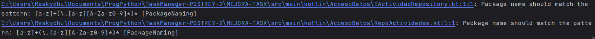
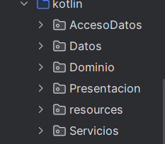

# Linting

En esta actividad vamos a instalar y utilizar Detekt, una herramienta de análisis estático para Kotlin.
Voy a hacer una guía de como instalarlo y vamos a utilizarlo para encontrar errores en el código del Task Manager.

## 1. **Instalando Detekt**

- Para instalar Detekt hay que añadir el plugin en el archivo `build.gradle`:

- En este mismo archivo se agrega la configuración básica de Detekt:

## 2. **Ejecutando Detekt**

- Para ejecutar Detekt, sólo tengo que usar el siguiente comando:

- Al ejecutar este comando, sale una pantalla con el resumen de los errores encontrados como esta:

## 3. **Identificando tipos de errores**

### ERROR 1: `NestedBlockDepth`

[Commit antes de solucionar error NestedBlockDepth](https://github.com/PabloOstenero/TaskManager-POSTREY-2/commit/bd584b406c2528f70abc6187e7b127f90cd3a861)

Este es el commit anterior a la correción del error. En este commit, la función cargarActividades tiene muchas llaves anidadas, lo cual no es en si un fallo, pero puede llevar a una mayor dificultad en la lectura del código. Para solucionar este error, se debe reducir la cantidad de llaves mediante funciones que sean más pequeñas y cumplan una sola función.

Así quedaría la función cargarActividades después de la corrección:

[Commit después de solucionar error NestedBlockDepth](https://github.com/PabloOstenero/TaskManager-POSTREY-2/commit/9b3006d397a49fd678232c2d2df18816cde2c1bb)

### ERROR 2: `PackageNaming`

[Commit antes de solucionar error PackageNaming](https://github.com/PabloOstenero/TaskManager-POSTREY-2/commit/9b3006d397a49fd678232c2d2df18816cde2c1bb)

En este caso, el error se debe a que el nombre delos paquetes no siguen la convención de nombres de Kotlin. Para solucionarlo, se debe cambiar la primera letra de los nombres de los paquetes a minúsculas.

Así quedarían los nombres de los paquetes después de la corrección:

Aparte de cambiar los nombres de los paquetes, también he comprobado que los imports de las clases se hayan actualizado correctamente, así como las rutas donde guardan los archivos de datos.

[Commit después de solucionar error PackageNaming](https://github.com/PabloOstenero/TaskManager-POSTREY-2/commit/18c1fadefc1decc73229e64a4a245b5aea6b9f2d)

### ERROR 3: `WildcardImport`

[Commit antes de solucionar error WildcardImport](https://github.com/PabloOstenero/TaskManager-POSTREY-2/commit/18c1fadefc1decc73229e64a4a245b5aea6b9f2d)

En este caso, el error se debe a que se están importando todas las clases de un paquete, lo cual no es recomendable ya que puede llevar a confusiones. Para solucionarlo, se deben importar sólo las clases necesarias, con lo cual se consigue una mayor limpieza y claridad en el código además de un menor riesgo de fallos por tener dos funciones con el mismo nombre por ejemplo.

Así quedaría el código después de la corrección:

En estas imagenes muestro los imports de la clase ActividadService por poner un ejemplo de un archivo con este error. Como se puede comprobar, al cambiar estos imports ahora se puede ver claramente que clases voy a utilizar en dicho archivo. Obviamente este es solo un ejemplo de los que hay, pero he corregido todos los wildcards innecesarios del proyecto.

[Commit después de solucionar error WildcardImport](https://github.com/PabloOstenero/TaskManager-POSTREY-2/commit/057d9d15729de6c26a79c443c9ab2d8a97a06fd1)